<h1 align="center"> what´s up guys, Mateus around here!</h1>

<p align="center">
  
</p>

<p align="center">
  💻 Desenvolvedor em formação | Tecnologia | Em constante lapso
</p>

---

## 👨‍💻 About me

* 🎓 Estudante de ADS (Análise e desenvolvimento de sistemas) / T.I
* ⚙️ Desenvolvendo projetos com programação e APIs
* ⚙️ Atualmente estudando desenvolvimento web e backend
* ⚙️ Buscando evoluir minhas habilidades e biblioteca mental
* ⚙️ Interessado em sistemas, hardware, linguagens e inteligência artificial
* ⚙️ Trabalhando atualmente com suporte de T.I

---

## 🛠️ Tech stack

### 🎨 Frontend

<p align="center">
  
</p>

### ⚙️ Backend

<p align="center">
  
</p>

### 🗄️ Banco de Dados

<p align="center">
  
</p>

### 🔧 Ferramentas

<p align="center">
  
</p>

---

## 📊 Github stats

<p align="center">
  
  
</p>


---

## Projetos

### 🤖 Assistente / API

Projeto desenvolvido com Node.js e Express para criação de uma API e integração com um assistente inteligente.

---

## 📚 Atualmente estudando

```text
HTML / CSS
JavaScript
Node.js
Express
APIs REST
Git & GitHub
Banco de Dados
Inteligência Artificial
```

---

## 📫 Contato

<p align="center">
  <a href="https://github.com/httpMateus0">
    
  <a href="https://instagram.com/http_mm0" target="_blank">
  
  </a>
</p>

---

<p align="center">
  
</p>


